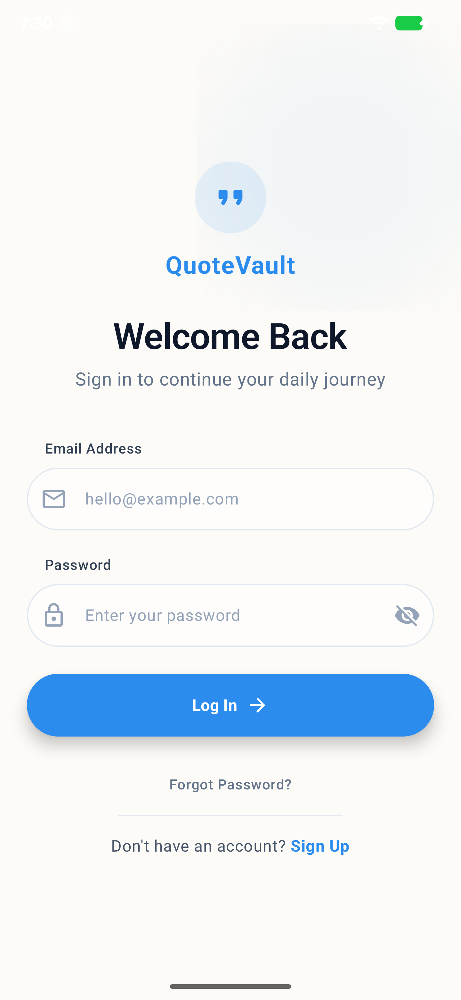
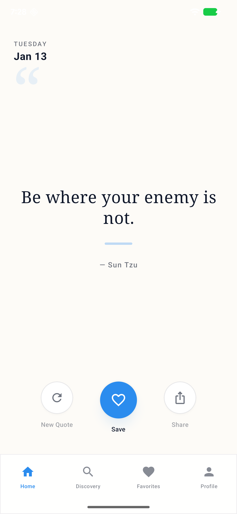
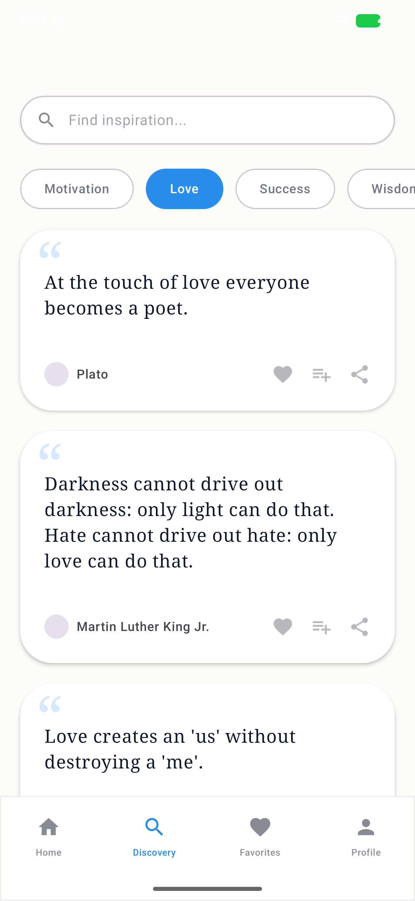
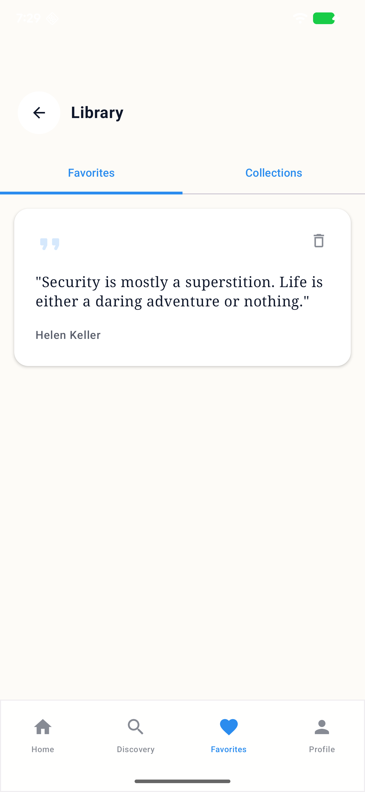
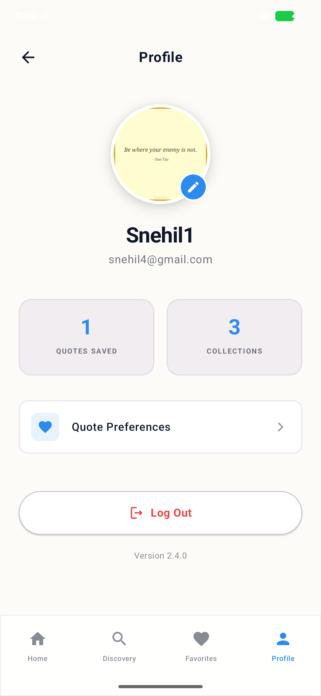
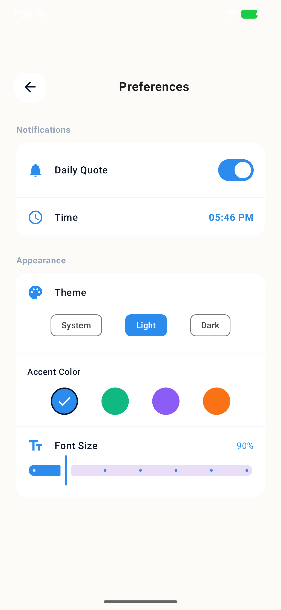

# QuoteVault 🔐✨

> A full-featured quote discovery and collection app built with **Jetpack Compose** and **Supabase**.

QuoteVault is a modern Android application designed to help users discover, collect, and share wisdom. Built as part of a comprehensive assessment of AI-assisted development, this app features user authentication, cloud synchronization, personalized themes, and daily inspiration widgets.

## 📥 Demo & Download

| **Demo Video** | **Download APK** |
|:---:|:---:|
| [🎥 Watch on Loom](https://www.loom.com/share/94d5f701433349d18274f7c8705c1e68) | [📲 Download QuoteVault.apk](https://drive.google.com/drive/folders/1cqoafNxLKwpcvo8I64UOg_TXtS_6MvyF?usp=sharing) |
| *Walkthrough of Auth, Sync & Widgets* | *Latest Build (v1.0)* |

*(Note: Please insert the actual Google Drive and APK links above before submitting)*

## 🤖 AI-First Development Workflow 

QuoteVault was not just coded; it was collaboratively designed and engineered with AI. This project demonstrates a multi-AI agent workflow to maximize quality and speed.

### 🧠 The Workflow Loop

1.  **Foundation (Human)**: I defined the core app idea and created a robust MVVM folder structure with dummy files in Android Studio. This gave the AI a clear "skeleton" to work with.
2.  **Context Loading (Gemini Pro)**: The repository skeleton was loaded into Gemini Pro, allowing it to understand the project's architecture before writing logic.
3.  **Visual Design (Stitch / Figma)**: I used Stitch to generate high-fidelity UI designs using natural language prompts.
4.  **Design-to-Code Conversion (Gemini Pro)**: I fed the HTML/CSS output from Stitch back into Gemini Pro to convert it into native Jetpack Compose code.
5.  **Backend Logic (Claude AI)**: Claude AI was used to handle the complex Supabase integration, ensuring secure auth flows and edge-case error handling.

### 🎨 UI Generation Prompts (Stitch)

To execute Step 3 of the workflow, the following detailed prompts were used in **Stitch**:
* **Home & Favorites**: *"Design a modern, minimalist mobile app for 'Daily Quotes'. Home Screen: A large, elegant serif font in the center... Favorites Screen: A vertical list of saved quotes cards..."*
* **Authentication**: *"Design modern, minimalist Authentication and Profile screens... Login Screen: Center-aligned content... Clean OutlinedTextFields..."*
* **Discovery**: *"Design a comprehensive 'Discovery' screen... seamlessly integrates browsing and search capabilities... Category Chips... Quote Feed..."*

## 📱 Screenshots

| Login & Sign Up | Home Feed | Discovery |
|:---:|:---:|:---:|
|  |  |  |
| **Login Screen** | **Daily Quote & Feed** | **Browse Categories** |

| Favorites & Collections | User Profile | Settings |
|:---:|:---:|:---:|
|  |  |  |  |
| **Saved Quotes** | **Profile Management** | **Personalization** | **Widget** |

| Home Screen Widget |
|:---:|
|  |
| **Daily Quote Widget** |

## 🚀 Features

* **Authentication & Accounts**:
    * Secure Email/Password Sign-up and Login using Supabase Auth.
    * **Password Reset Flow** for account recovery.
    * **Session Persistence** (users stay logged in across restarts).
    * User Profile management (Name, Avatar uploads).
* **Quote Browsing & Discovery**:
    * Browse quotes by categories (Motivation, Love, Success, Wisdom, Humor).
    * **Search Functionality**: Search quotes by keyword and **filter by Author**.
    * Infinite scrolling home feed with **Graceful Loading & Empty States**.
    * Pull-to-refresh functionality.
* **Collections & Favorites**:
    * Like/Heart quotes to save them to your favorites.
    * **Custom Collections**: Create and organize quotes into specific groups (e.g., "Work Quotes").
    * **Cloud Sync**: Favorites and collections persist across devices.
* **Daily Quote & Notifications**:
    * "Quote of the Day" prominently displayed on the home screen.
    * Daily updates via local logic/server.
    * **Local Push Notifications** with **User-Configurable Time** settings.
* **Personalization**:
    * Dark Mode / Light Mode toggle.
    * **Theme Customization**: Multiple accent color options.
    * Font size adjustment for readability.
    * **Settings Sync**: User preferences sync to their profile in the cloud.
* **Sharing**:
    * Share quotes as text via system sheet.
    * **Quote Card Generator**: Create shareable images with 3 distinct styles (Classic, Modern, Artistic).
    * Save generated images directly to the device.
* **Widget**:
    * Home screen widget displaying the current quote.
    * Daily updates and deep-linking to the app.

## 📐 Detailed Architecture & Logic

The app follows a clean **MVVM (Model-View-ViewModel)** architecture with a repository pattern to mediate between local storage and the cloud.

### 1. Data Synchronization (`QuoteRepository.kt`)
The repository acts as the single source of truth. It implements a specific sync logic to ensure offline availability while keeping data consistent with the cloud.
* **Sync Logic**: When the user refreshes or logs in, `syncFavorites()` fetches all `user_favorites` from Supabase.
* **Duplicate Prevention**: It compares cloud data against the local Room database (`FavoriteDao`). Only non-existing quotes are inserted locally.
* **Toggle Logic**: When a user "hearts" a quote, it is immediately saved to the local Room DB (for instant UI feedback) and asynchronously pushed to the Supabase `user_favorites` table.

### 2. Authentication (`AuthManager.kt`)
A dedicated manager wraps the Supabase GoTrue client to handle user sessions.
* **Metadata Handling**: User names and avatar URLs are stored in Supabase `user_metadata`.
* **Avatar Uploads**: The app converts profile images to ByteArrays and uploads them to a Supabase Storage bucket named `avatars`. The public URL is then patched back into the user's profile metadata.
* **Error Sanitization**: Raw network errors are intercepted and converted into user-friendly messages (e.g., converting "400 Bad Request" to "Invalid credentials").

### 3. Widget System (`QuoteWidgetProvider.kt`)
The Home Screen widget is built to be battery-efficient and independent of the app's UI process.
* **Data Source**: It does *not* query the database directly. Instead, it reads the "Daily Quote" stored in `SharedPreferences` (via `PreferencesManager`) to ensure instant loading.
* **Updates**: The widget updates via `AppWidgetManager.updateAppWidget` using `RemoteViews`. Clicking the widget launches `MainActivity` via a `PendingIntent`.

### 4. Custom Image Generation (`ShareUtils.kt`)
The "Share as Image" feature uses native Android 2D drawing APIs.
* **Canvas Drawing**: The app programmatically draws the quote text, author, and watermarks onto a `Bitmap` using a `Canvas`.
* **Dynamic Styles**: It supports three rendering styles defined in `QuoteStyle`:
    * *Classic*: Serif font on white background.
    * *Modern*: Sans-serif font on dark slate background.
    * *Artistic*: Italic font on cream background with a gold border.
* **Scoped Storage**: Images are saved to the Gallery using `MediaStore` APIs, ensuring compatibility with Android 10+ scoped storage rules.

### 5. Notifications (`NotificationScheduler.kt`)
* **Exact Alarms**: Uses `AlarmManager` to schedule daily notifications.
* **Doze Mode Support**: Implements `setExactAndAllowWhileIdle` to ensure the quote arrives even if the phone is in deep sleep.
* **Permission Handling**: Automatically checks for `SCHEDULE_EXACT_ALARM` permissions on Android 12+.

## 🛠 Tech Stack

* **Language**: [Kotlin](https://kotlinlang.org/)
* **UI Framework**: [Jetpack Compose](https://developer.android.com/jetbrains/compose) (Material3)
* **Backend & Auth**: [Supabase](https://supabase.com/) (PostgreSQL, GoTrue, Storage)
* **Network**: Retrofit (Quotes API) & Ktor (Supabase)
* **Local Database**: Room Database
* **Image Loading**: Coil
* **Design Tool**: Figma / Stitch
* **Design Link**: [https://stitch.withgoogle.com/projects/15837881195008214574](https://stitch.withgoogle.com/projects/15837881195008214574)

## ⚙️ Setup Instructions

1.  **Clone the Repository**
    ```bash
    git clone [https://github.com/snehil208001/quotevault.git](https://github.com/snehil208001/quotevault.git)
    cd quotevault
    ```

2.  **Supabase Configuration**
    The project is currently configured with a public Supabase instance for testing purposes.
    * Configuration file: `app/src/main/java/com/BrewApp/dailyquoteapp/data/auth/SupabaseClient.kt`
    * *Note: For production, ensure API keys are stored in `local.properties` or environment variables.*

3.  **Build the Project**
    * Open the project in **Android Studio Ladybug (or newer)**.
    * Sync Gradle files.
    * Run on a Pixel 6/7 Emulator (API 35).

## 📄 License

This project is created for an assessment assignment.
